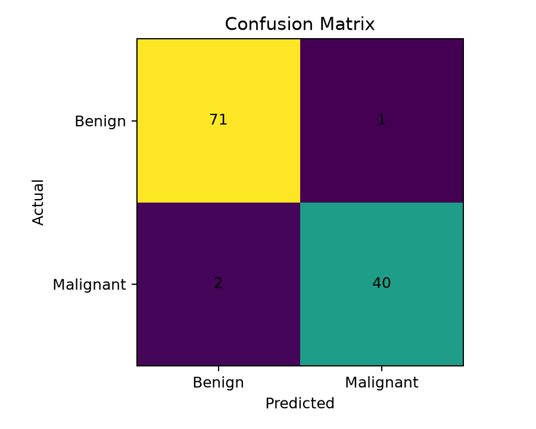
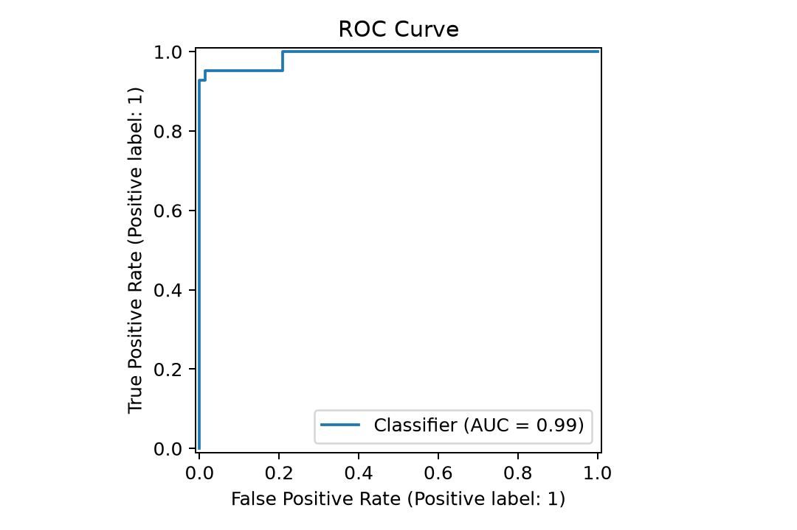
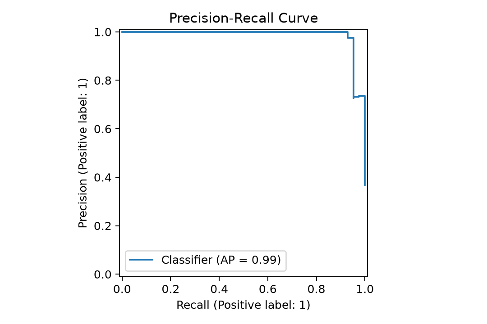
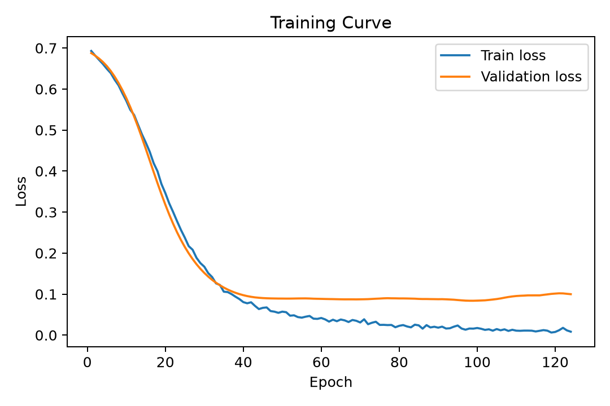
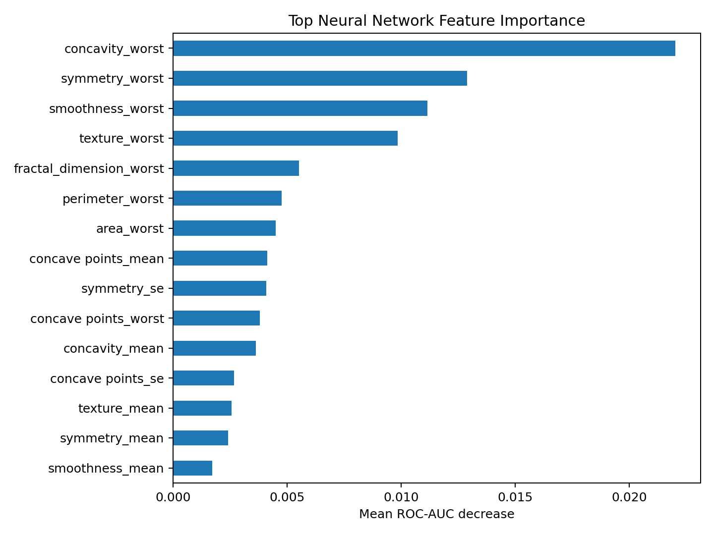

# 🩺 Breast Cancer Detection — Neural Network ML Project

> **A complete, leakage-safe, recall-focused machine-learning portfolio project with a PyTorch Neural Network, benchmark models, reproducible inference, Streamlit dashboard, tests and CI.**

[](https://www.python.org/)
[](https://pytorch.org/)
[](https://streamlit.io/)
[](https://github.com/mdamaanali-ai/breast-cancer-detection/actions)
[](LICENSE)

## ⚠️ Medical disclaimer

**This is an educational machine-learning demonstration, not a medical diagnostic system.** It must not be used to diagnose, treat, or rule out cancer. Real clinical deployment requires external validation, prospective studies, calibration, clinical oversight, regulatory review and appropriately governed patient data.

---

## 🌟 What makes this project 10/10 portfolio-ready

- **Primary deployed model is the same model presented in the analysis:** a PyTorch Neural Network.
- Leakage-safe preprocessing: the scaler is fitted **only on training data**.
- Stratified train/validation/test workflow with a fixed seed.
- BatchNorm, dropout, AdamW and validation-based early stopping.
- Decision threshold selected on the validation split rather than tuned on the test set.
- Benchmarks against Logistic Regression, Random Forest and XGBoost.
- Reports sensitivity/recall **and** specificity instead of relying on accuracy alone.
- Includes confusion matrix, ROC, PR, calibration, feature-importance and training visuals.
- Reusable inference code shared by CLI and Streamlit.
- Input validation for missing, non-numeric and infinite feature values.
- Interactive Streamlit dashboard with CSV upload and downloadable predictions.
- Automated tests and GitHub Actions CI.
- Original notebook, report and demo video are preserved from the supplied project.

---

## 📊 Held-out test performance

| Metric | Neural Network |
|---|---:|
| Accuracy | **97.37%** |
| Precision | **97.56%** |
| Sensitivity / Recall | **95.24%** |
| Specificity | **98.61%** |
| F1 | **96.39%** |
| ROC-AUC | **0.990** |
| PR-AUC | **0.987** |

These are results on the supplied WDBC dataset's held-out test split. They are **not clinical performance claims**.

### Model benchmark

The original project also evaluates Logistic Regression, Random Forest and XGBoost. The benchmark is preserved in [`model_comparison.csv`](model_comparison.csv).

The Neural Network is the **primary deployed model** for consistency across the notebook, saved artifact, CLI and Streamlit app. The benchmark table is intentionally shown so the project demonstrates model selection rather than hiding alternatives.

---

## 🧠 Model architecture

```text
30 WDBC features
      │
      ▼
Linear 30 → 64
      │
BatchNorm → ReLU → Dropout(0.25)
      │
      ▼
Linear 64 → 32
      │
ReLU → Dropout(0.15)
      │
      ▼
Linear 32 → 16
      │
ReLU
      │
      ▼
Linear 16 → 1
      │
      ▼
Sigmoid probability
      │
      ▼
Validation-selected threshold
      │
      ├── BENIGN
      └── MALIGNANT
```

---

## 🔬 Methodology

### 1. Dataset

The project uses the supplied **Wisconsin Diagnostic Breast Cancer (WDBC)** CSV:

- 569 observations
- 30 numeric predictive measurements
- Target: `diagnosis`
- `M` = malignant
- `B` = benign
- `id` and the empty `Unnamed: 32` column are excluded from modeling

### 2. Leakage-safe splitting

The data is split using stratification:

```text
Full dataset
     │
     ├── 80% training partition
     │       ├── 80% actual training
     │       └── 20% validation
     │
     └── 20% untouched test set
```

The scaler is fitted **only on the actual training partition** and then applied to validation/test data.

### 3. Threshold selection

Instead of automatically using 0.50, candidate thresholds are evaluated on the validation data. The selected threshold favors sensitivity while maintaining the project's precision constraint. The chosen threshold is then frozen before test evaluation.

### 4. Evaluation

The project reports:

- Accuracy
- Precision
- Sensitivity / Recall
- Specificity
- F1
- ROC-AUC
- PR-AUC
- Confusion matrix

This is particularly important because accuracy alone can hide clinically important false negatives.

---

## 🖥️ Streamlit app

The interactive app provides:

- Project overview
- Test-set metrics
- Confusion matrix and ROC visualization
- CSV upload
- Batch prediction
- Prediction probabilities
- Downloadable prediction CSV
- Model comparison
- Methodology explanation

Run it locally:

```powershell
streamlit run app.py
```

---

## 🚀 Run on Windows / VS Code

### 1. Clone or extract the repository

Open the project folder in VS Code.

### 2. Create a virtual environment

```powershell
python -m venv .venv
```

### 3. Activate it

```powershell
.venv\Scripts\activate
```

### 4. Install dependencies

```powershell
python -m pip install --upgrade pip
pip install -r requirements.txt
```

### 5. Rebuild the model

```powershell
python train_model.py
```

This writes:

```text
models/breast_cancer_nn.joblib
```

### 6. Test batch inference

```powershell
python predict.py data/data_breast_cancer.csv
```

Or:

```powershell
python scripts/predict.py data/data_breast_cancer.csv --output outputs/predictions.csv
```

### 7. Launch the dashboard

```powershell
streamlit run app.py
```

### 8. Run tests

```powershell
pytest -q
```

### 9. Run the notebook

Open:

```text
notebooks/Breast_Cancer_Detection.ipynb
```

Select the project `.venv` kernel and use **Run All**.

---

## 📦 Input CSV format

The model requires these 30 columns:

```text
radius_mean, texture_mean, perimeter_mean, area_mean, smoothness_mean,
compactness_mean, concavity_mean, concave points_mean, symmetry_mean,
fractal_dimension_mean, radius_se, texture_se, perimeter_se, area_se,
smoothness_se, compactness_se, concavity_se, concave points_se, symmetry_se,
fractal_dimension_se, radius_worst, texture_worst, perimeter_worst, area_worst,
smoothness_worst, compactness_worst, concavity_worst, concave points_worst,
symmetry_worst, fractal_dimension_worst
```

Extra columns such as `id` and `diagnosis` are allowed and are preserved in the output.

---

## 📁 Project structure

```text
breast-cancer-detection/
│
├── app.py                         # Streamlit dashboard
├── predict.py                     # Simple CLI entry point
├── train_model.py                 # Simple training entry point
├── requirements.txt
├── README.md
├── LICENSE
├── CONTRIBUTING.md
├── CHANGELOG.md
├── .gitignore
│
├── src/
│   ├── __init__.py
│   ├── model.py                   # NN architecture + feature contract
│   └── inference.py               # Shared validation + prediction logic
│
├── scripts/
│   ├── train_model.py             # Reproducible training
│   └── predict.py                 # Batch inference implementation
│
├── tests/
│   └── test_inference.py
│
├── data/
│   └── data_breast_cancer.csv
│
├── models/
│   └── breast_cancer_nn.joblib
│
├── notebooks/
│   ├── Breast_Cancer_Detection.ipynb
│   └── Breast_Cancer_Detection_executed.ipynb
│
├── assets/
│   ├── class_distribution.png
│   ├── confusion_matrix.png
│   ├── roc_curve.png
│   ├── pr_curve.png
│   ├── calibration.png
│   ├── feature_importance.png
│   └── training_curve.png
│
├── reports/
│   ├── Breast_Cancer_Detection_Project_Report.pdf
│   ├── breast_cancer_linkedin_demo.mp4
│   └── linkedin_post.txt
│
├── model_comparison.csv
│
├── .github/workflows/ci.yml
└── .streamlit/config.toml
```

---

## 🖼️ Results

### Confusion matrix



### ROC curve



### Precision-recall curve



### Training behavior



### Feature importance



---

## 🧪 Reproducibility checklist

- Random seed: **42**
- Stratified train/test split
- Validation split from training data only
- Training-only scaler fitting
- Early stopping using validation loss
- Threshold selection using validation data only
- Frozen threshold for held-out test evaluation
- Model artifact stores the NN weights, scaler, features, threshold and metrics

---

## 📚 Included original project work

This upgraded release intentionally preserves the strongest parts of the supplied project:

- Original analysis notebook
- Executed notebook
- Original visualizations
- Model comparison table
- Project report PDF
- LinkedIn demo video
- LinkedIn post draft

They are reorganized into a cleaner portfolio structure rather than discarded.

---

## 👨‍💻 Author

**Mohammed Amaan Ali**  
AI & ML / Data Science Portfolio

- GitHub: `mdamaanali-ai`
- LinkedIn: `Md Amaan Ali`

---
## live demo
[](https://breast-cancer-detection-fkibvhmwur8aen6r5lz7cu.streamlit.app/)


## 📄 License

MIT License. See [`LICENSE`](LICENSE).
